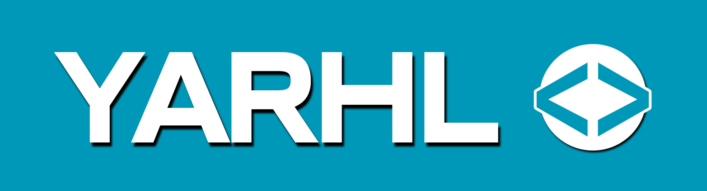

# Yarhl, A format ResearcH Library 

<!-- markdownlint-disable MD033 -->

  
  &nbsp;
  
  &nbsp;
  
  &nbsp;
  
  &nbsp;
  
  &nbsp;

_Yarhl_ is a set of libraries that helps to **implement and convert file
formats** It empowers you with...

- ♻️ ... APIs to easily **convert** between custom formats.
- 📚 ... **guidelines** to implement and test custom format converters.
- 🔢 ... advance **binary and text** reading / writing, encoding and
  serialization.
- 📃 ... **standard formats** implementation like **PO** for translations.
- 📂 ... virtual **file system** to unpack and pack containers efficiently.

## Usage

The project has the following .NET libraries (NuGet packages via nuget.org). The
libraries only support the latest .NET LTS version: **.NET 6.0**.

- 
  - `Yarhl.FileFormat`: format conversion APIs.
  - `Yarhl.FileSystem`: virtual file system.
  - `Yarhl.IO`: streams, binary and text reading / writing.
- 
  - `Yarhl.Media.Text`: translation formats and converters (Po), table replacer.
  - `Yarhl.Media.Text.Encoding`: _euc-jp_ and token-escaped encodings.
- 
  - `Yarhl.Plugins`: discover formats and converters from .NET assemblies.

> [!NOTE]  
> _Are you planning to try a preview version?_ Check-out the
> [GitHub project readme](https://github.com/SceneGate/Yarhl#install) for
> details how to get setup the NuGet preview feed.

## Quick demo

You can use _Yarhl_ to create applications that converts file formats. For
instance, let's extract the text from a game into a translatable file format
like [PO](https://www.gnu.org/software/gettext/manual/html_node/PO-Files.html).
We can use the following libraries for this task:

- [Yarhl.Media.Text](./articles/media-text/po-format.md): support for PO format.
- [Ekona](https://github.com/SceneGate/Ekona/): support of NDS game file system.
- [LayTea](https://github.com/pleonex/LayTea): support for formats from
  _Professor Layton_ games.

The flow of format conversions would be:

[!code-csharp[Demo1](./../src/Yarhl.Examples/Introduction.cs?name=Demo1)]

At this point, we can also interact with any format. For instance, let's change
a translation entry.

[!code-csharp[Demo2](./../src/Yarhl.Examples/Introduction.cs?name=Demo2)]

## Showcase

Some cool projects built with _Yarhl_:

- [**Ekona**](https://scenegate.github.io/Ekona/): support Nintendo DS file
  formats.
- [**Lemon**](https://scenegate.github.io/Lemon/): support Nintendo 3DS file
  formats.
- [**LayTea**](https://www.pleonex.dev/LayTea/): modding tools for _Professor
  Layton_ games.
- [**Attack of Friday Monsters tools**](https://github.com/pleonex/AttackFridayMonsters):
  modding tools for _Attack of the Friday Monsters_ game.
- [**Metatron**](https://github.com/TraduSquare/Metatron): translation framework
  for _Shin Megami Tensei_ saga games.

## License

The software is licensed under the terms of the
[MIT license](https://choosealicense.com/licenses/mit/).
