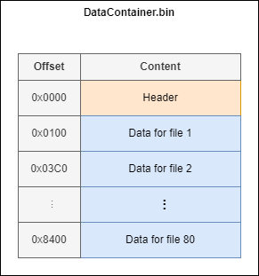
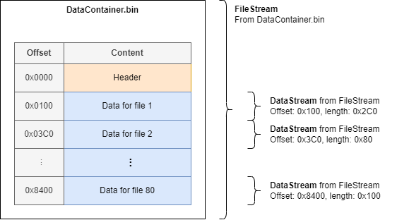

# DataStream

[`DataStream`](xref:Yarhl.IO.DataStream) is an enhanced version of .NET
[`Stream`](xref:System.IO.Stream) class. It inherits `Stream`, being compatible
with any existing API that uses `Stream` as input.

Its main feature is the ability to create thread-safe **_sub-streams_**. It
allows to work with a segment of a `Stream` without copying or allocating any
memory.

## Sub-streams

A _sub-stream_ is _view_ of a part of a regular **Stream**. Just like in .NET
[`Span<T>`](xref:System.Span`1) allows to work with a segment of an array,
`DataStream` allows to do it with a `Stream` but keeping the same API as any
other regular `Stream`.

When you create a `DataStream` from another `Stream` you can specify its
_offset_ and _length_ to perform IO operations (reading / writing) only in that
segment.

Let's imagine we have a binary format for a container (like a _zip_ or _tar_
file without compression). In this format the content for the first file is in
the position `0x100`. The content for the second file is at `0x3C0`.



If we want to only work with the data of the second file, we could create a
_sub-stream_ that starts at `0x3C0` and has the file length. It will allow to
have a `Stream` object based on the parent `Stream`. We can now pass this new
stream to any other API, for instance to a JSON deserializer to read its
content, without having to _export_ or do any prior copy.



Another use case is reading a binary format with sections. By creating a
`DataStream` for each individual section, the application can have a design more
modular and safe. It would prevent reading data outside the range of the
section.

## Factory

The constructors of `DataStream` takes a `Stream` with optional offset and
lengths for _sub-streams_. You can also create a `DataStream` from other source
via the [`DataStreamFactory`](xref:Yarhl.IO.DataStreamFactory).

It can quickly initialize a new `DataStream` from memory:

```csharp
using var stream = DataStreamFactory.FromMemory();
```

> [!TIP]  
> Internally it uses the memory-efficient API from Microsoft:
> [`Microsoft.IO.RecyclableMemoryStream`](https://github.com/microsoft/Microsoft.IO.RecyclableMemoryStream).
> It keeps a range of buffers on memory allowing to re-use them without having
> to allocate memory twice. It may however consume more memory even when it's
> not used.

or from an array of bytes:

```csharp
byte[] dataBuffer = ...

using var stream = DataStreamFactory.FromArray(dataBuffer);
```

or from an existing or new file:

```csharp
using var stream = DataStreamFactory.FromFile("input/file.bin", FileOpenMode.Read);

// or even a part of a file: only 0x40 bytes from 0x100.
using var stream = DataStreamFactory.FromFile("input/file.bin", FileOpenMode.Read, 0x100, 0x40);
```

where [`FileOpenMode`](xref:Yarhl.IO.FileOpenMode) is an enumeration that
internally maps to the .NET enumerations `FileMode` and `FileAccess` as follow:

- `FileOpenMode.Read`: read a file, throwing an exception if it doesn't exists.
  Maps to `FileMode.Open` and `FileAccess.Read`.
- `FileOpenMode.Write`: write a file, creating a new if it doesn't exist or
  truncating it it does. Maps to `FileMode.Create` and `FileAccess.Write`.
- `FileOpenMode.ReadWrite`: allow to read and write to a file. If it doesn't
  exist it will create a new one but it does **not truncate if the file exists**
  (to allow reading). Maps to `FileMode.OpenOrCreate` and
  `FileAccess.ReadWrite`.
- `FileOpenMode.Append`: append data to the end, if it doesn't exist it will
  throw an exception. Maps to `FileMode.Append` and `FileAccess.Write`

> [!NOTE]  
> The file is _lazily open_. This means it will not actually open the file until
> the first read or write operation happens on the `Stream`. It allows having
> hundreds of `DataStream` on different files ready without running out of
> resources in the operative system.

> [!TIP]  
> `FileOpenMode` is handy enumeration that covers most use cases. If you require
> any other combination of `FileMode` and `FileAccess` you can create the
> `FileStream` by hand and pass it to the `DataStream` constructor or
> `FromStream` methods.

Finally the factory also provides the methods
[`FromStream`](<xref:Yarhl.IO.DataStreamFactory.FromStream(System.IO.Stream,System.Int64,System.Int64)>)
similar to the parameters accepted by the constructor of
[`DataStream`](xref:Yarhl.IO.DataStream).

## IO operations

`DataStream` supports the same read and write operations as any other standard
.NET `Stream`. It also provides some additional methods.

### Writing to a file

The [`WriteTo`](<xref:Yarhl.IO.DataStream.WriteTo(System.String)>) API allows to
write the entire content of the stream into a file on the given path. This
applies to the content that targets this `DataStream`, not the entire parent
`Stream`.

> [!NOTE]  
> The method ignores the current position, it will always start writing from the
> start to the end. It will **restore** the current position after comparing.

The path should point to the output file. If there is any directory that doesn't
exist, it will create them first.

```csharp
using var stream = new DataStream(...);
// ...
stream.Position = 80;
// ...

// Write the entire Stream from 0 to the end.
// It creates the folder 'output' if it doesn't exist.
stream.WriteTo("output/file.bin");
```

### Comparing data

The method [`Compare`](<xref:Yarhl.IO.DataStream.Compare(System.IO.Stream)>)
allows to compare byte-to-byte the content of the current stream against
another. If will return `false` if any byte between the two streams are
different. It will also return `false` if the length does not match.

> [!NOTE]  
> The method ignores the current position. It will always start reading **both
> Streams** from the start to the end. It will **restore** the current position
> after comparing.

```csharp
using var myStream = new DataStream(...);
myStream.Position = 80;

using var otherFile = new FileStream(...);

// Compare both streams from 0 to end
bool result = myStream.Compare(otherFile);
```

### Positions stack

Inspired by the _Unix commands `pushd` and `popd`_, `DataStream` provides a set
of APIs that simplifies the use cases of changing position to read / write some
data and go back.

For instance, imagine the format has a table with file names in a separate
section. We could quickly read the string without having to store the current
position:

```csharp
stream.Position = 0x100;

// Save current position and move to 0x800
stream.PushToPosition(0x800);
string name = ReadFilename(stream);
stream.PopPosition(); // return to 0x100, keep reading from there
```

[`PushToPosition`](<xref:Yarhl.IO.DataStream.PushToPosition(System.Int64,System.IO.SeekOrigin)>)
will move to the given position, saving the current position in an internal
stack. Calling [`PopPosition`](xref:Yarhl.IO.DataStream.PopPosition) will return
to our original position.

The class also provides
[`PushCurrentPosition`](xref:Yarhl.IO.DataStream.PushCurrentPosition). It saves
the current position into the stack. For instance, before calling an external
method that may modify our position.

Finally, the method
[`RunInPosition`](<xref:Yarhl.IO.DataStream.RunInPosition(System.Action,System.Int64,System.IO.SeekOrigin)>)
allows to run an action such as a lambda expression or a method saving and
restoring our current position. We could re-write the previous example as:

```csharp
stream.Position = 0x100;

string name;
stream.RunInPosition(() => name = ReadFilename(stream), 0x800);
```

### Writing segments

The
[`WriteSegmentTo`](<xref:Yarhl.IO.DataStream.WriteSegmentTo(System.Int64,System.String)>)
APIs allows to write a part of our `DataStream` into `Stream` or file on disk.
This is a shortcut to create a temporary `DataStream` and run the regular
`WriteTo` method.

```csharp
var stream = new DataStream(...);

// Write starting at 0x100 to the end
stream.WriteSegmentTo(0x100, otherStream);
stream.WriteSegmentTo(0x100, "outputs/data.bin");

// Write 0x40 bytes starting at 0x800
stream.WriteSegmentTo(0x800, 0x40, otherStream);
stream.WriteSegmentTo(0x800, 0x40, "outputs/data.bin");
```

### Closing / Disposing

By default a `DataStream` takes the _ownership_ of the base `Stream` object
passed. By disposing the `DataStream` it will dispose as well its parent
`Stream`.

If we are working with _sub-streams_ the behavior is different. The API will
keep a **count of `DataStream` using a `Stream` object.** Disposing a
`DataStream` will decrease the count. Creating a new `DataStream` (via
constructor or factory) will increase the count. When the count reaches 0 in a
`Dispose` object, it will also dispose its parent.

In the above format example, disposing the `DataStream` for file 1 and 2 will
not still dispose its parent `FileStream`, as we have still one for file 80.
Calling `Dispose` for the `DataStream` of file 80, will dispose the `FileStream`
as well.

```csharp
var parentStream = new FileStream(...);

var file1Stream = new DataStream(parentStream, 0x100, 0x2C0);
var file2Stream = new DataStream(parentStream, 0x3C0, 0x80);
var file80Stream = new DataStream(parentStream, 0x8400, 0x100);

file1Stream.Dispose();
file2Stream.Dispose();

// parentStream is still open. We can do read and write from it or file80Stream

file80Stream.Dispose(); // <-- It will also dispose parentStream
```

You can control this behavior by using the
[constructor that takes the argument `bool transferOwnership`](<xref:Yarhl.IO.DataStream.%23ctor(System.IO.Stream,System.Int64,System.Int64,System.Boolean)>).
Pass a `false` value to never dispose the parent `Stream`.

> [!TIP]  
> You can get the total number of `DataStream` created via the static property
> [`ActiveStreams`](xref:Yarhl.IO.DataStream.ActiveStreams).

## Thread-safety

The `DataStream` is thread-safe at the level of the sub-stream.

For instance, it is safe to use several `DataStreams` over the same base
`Stream` in parallel. `DataStream` will wait for their turn to use the parent
`Stream` for each IO operation. Ensure they are at the required position always.

The type **is not thread-safe for its methods**. For instance, it is **NOT safe
to use the same `DataStream`** in different threads at the same time. It's not
safe to change the position of the `DataStream` in one thread while another is
reading. **Please create a new `DataStream` for each thread.**

The thread-safety is based in that there isn't any other part of the application
accessing to the parent `Stream` directly. Every IO operation should happen over
a `DataStream`.
