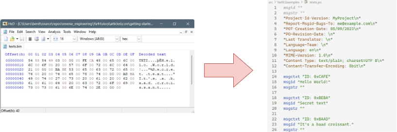
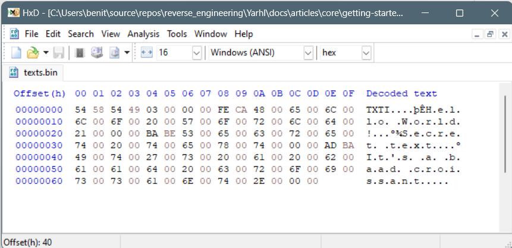
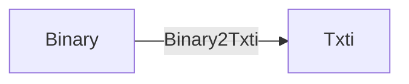
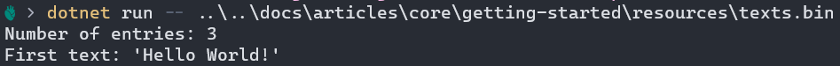
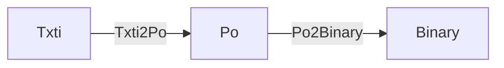
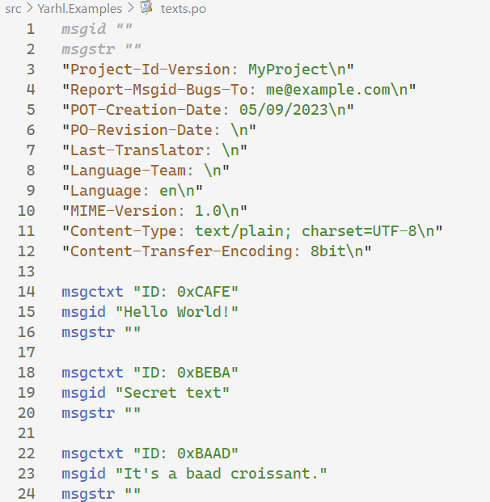
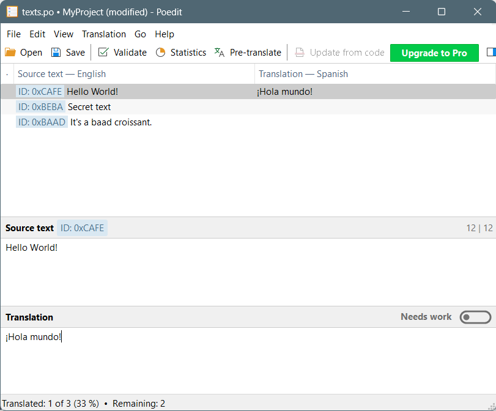
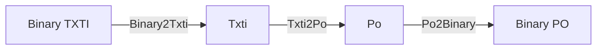

# Getting started guide

**_Welcome to Yarhl!_** 🎉  
This step-by-step guide covers how to create your first program that works with
custom file formats.

You will learn how to:

- 🔧 setup a C# project with the _Yarhl_ dependencies.
- 📃 analyze a specification and **implement a file format**.
- 🧮 **read binary data** and convert it into a format.
- ♻️ **convert a text format** into a standard like GNU Gettext PO.

By the end of this guide you will have a program that converts a binary file
into an editable text file!



Prepare your self a good cup of 🍵 or ☕ and let's dive into it! 🤿  
And if you have any question along the way don't hesitate to
[ask for help](https://github.com/SceneGate/Yarhl/discussions).

> [!NOTE]  
> This guide covers how to create the project in the **.NET language C#**, but
> it should be fairly similar in any other .NET languages like F# or Visual
> Basic .NET.  
> Unfortunately Yarhl is not supported outside .NET languages.

> [!TIP]  
> If you aer new into .NET development, start by learning with the free course
> of C# from [Microsoft](https://aka.ms/selfguidedcsharp).

## Pre-requisites

Before starting you need to setup your computer to create .NET projects. You
will need:

- Latest version of the [.NET SDK](https://dotnet.microsoft.com/en-us/download)
- A programming IDE for C# development.
  - On Windows you can use
    [Visual Studio Community](https://visualstudio.microsoft.com/vs/community/)
  - [Visual Studio Code](https://code.visualstudio.com/) with the C# extension
    is also great and works in every major platform.
  - [JetBrains Rider](https://www.jetbrains.com/rider/) is a cool alternative to
    Visual Studio and works on every platform, but it's a paid product.
- (Optional) Hexadecimal viewer. Some options are:
  - [ImHex](https://github.com/WerWolv/ImHex): cross-platform.
  - [HxD](https://mh-nexus.de/en/downloads.php): Windows only.
  - [Okteta](https://apps.kde.org/en-gb/okteta/): Linux with KDE.

Also download the following binary file that our program will take as input:
[texts.bin](./resources/texts.bin).

## Project setup

Let's start by creating a new C# console project. It depends with the type of
IDE you are using.

### [Visual Studio](#tab/vs)

[Microsoft docs](https://learn.microsoft.com/en-us/visualstudio/get-started/csharp/tutorial-console)
describe how to setup a new project with the latest version of their IDE.

### [Visual Studio Code](#tab/vscode)

[Visual Studio Code docs](https://code.visualstudio.com/docs/csharp/get-started#_create-a-hello-world-app)
describe how to setup and create a new C# project within the IDE.

### [Terminal](#tab/terminal)

In general, one of the easiest way to create a C# projects is to use the
terminal. Open a new window and move to the folder where you want to create the
project. Then type: `dotnet new console --name MyFirstConverterTool`

---

Now we have an empty project let's add the Yarhl dependency. Open your project
file (file with extension `.csproj`) and add a new _package reference_. It will
download the dependencies from
[nuget.org](https://www.nuget.org/packages?q=Yarhl).

```xml
<ItemGroups>
  <PackageReference Include="Yarhl" Version="4.0.0" />
  <PackageReference Include="Yarhl.Media.Text" Version="4.0.0" />
</ItemGroups>
```

Nice, we have an application ready to add some code.

> [!TIP]  
> Check-out [nuget.org](https://www.nuget.org/packages?q=Yarhl) for the latest
> version available of Yarhl.

## Format specification

Our goal is to make a program that converts the downloaded file `texts.bin` into
a new file in a format that we can easily open, like a text file `.txt`. We can
inspect the content in its pure format, bytes, by using programs such as
_hexadecimal viewers_.



We can see there isn't only text but bytes with other meanings. This file
matches the following specification:

| Offset | Type        | Description              |
| ------ | ----------- | ------------------------ |
| 0x0000 | `char[4]`   | Format identifier `TXTI` |
| 0x0004 | Int32       | Number of texts          |
| 0x0008 | TextEntry[] | List of text entries     |

where `TextEntry` is:

| Offset | Type   | Description                          |
| ------ | ------ | ------------------------------------ |
| 0x0000 | Int16  | Entry ID                             |
| 0x0002 | String | Text null-ended with UTF-16 encoding |

## Format implementation

From the above specification we are interested in keeping a **list of _entries_
with their identifier number and text content**. Next step is to create a new
class to represent this format.

Let's create a new class named `TxtiFormat`. It will have a property with the
collection of entries (initialized for convenience).

[!code-csharp[TxtiFormat](../../../../src/Yarhl.Examples/Tutorial/TxtiFormat.cs?name=Class&highlight=4)]

Did you notice the **inheritance with `IFormat`**?  
Format models should implement the interface `IFormat`. In this way Yarhl knows
that this type implements a format. The interface is empty, it doesn't need to
implement any specific method or property, it acts as a marker.

Now let's create a second class to represent the `TextEntry`:

[!code-csharp[TextEntry](../../../../src/Yarhl.Examples/Tutorial/TextEntry.cs?name=Class&highlight=1)]

This time we don't need to inherit from `IFormat` as this class does not
represent a file format itself. It's part of one.

😎 Cool, we have our first **file format implemented!** It's time to add some
code to fill these classes from the file `texts.bin`.

## Converting binary data into the format

First we will do what it's named **deserialization**: reading binary data from a
file to fill a model.

To do so we will create a **converter** class. It's goal is to _convert a binary
format, the data from the file, into the `TxtiFormat` model_.



Create a new class `Binary2Txti` and implement the interface
`IConverter<IBinary, TxtiFormat>`.

[!code-csharp[Binary2Txti class definition](../../../../src/Yarhl.Examples/Tutorial/Binary2Txti.cs?name=Class&highlight=5)]

The interface asks to have a method that performs the conversion:
`TxtiFormat Convert(IBinary source)`. It takes as an input any binary format and
produces as an output the model `TxtiFormat`. Add the method to our class.

It's time to start adding code to read data from the file. First we need a
_binary reader_ class that will help us to read integers and strings from binary
content. Yarhl provides an enhanced version of .NET `BinaryReader` with the
class `DataReader`.

[!code-csharp[Binary2Txti reading first 4 chars](../../../../src/Yarhl.Examples/Tutorial/Binary2Txti.cs?name=ValidateHeader&highlight=1,5)]

As a start, we read the first 4 characters of the file that according to our
[specification](#format-specification) they must be `TXTI`. This guarantees we
are reading the format we expect.

Now it's time to get the number of entries and iterate for each of them. As we
know, each entry has an ID followed by the text. We will add them to a new
instance of our target format `TxtiFormat`. Finally we return it from the
`Convert` method.

[!code-csharp[Binary2Txti reading text entries](../../../../src/Yarhl.Examples/Tutorial/Binary2Txti.cs?name=ReadEntries)]

And voilà 🚀. You have your first **format converter**.

## Use the converter

Let's try our cool format and converter. Going back to `Program.cs` let's add
some code to the `Main` method, our application entrypoint, so it opens the file
and convert it.

First we need to open the file on disk and create our source format: a binary
format. We will take the file path from the program command-line arguments.

[!code-csharp[Creating a stream from a file](../../../../src/Yarhl.Examples/Tutorial/Program.cs?name=OpenFile)]

Next, let's create an instance of our converter and convert/read that file!

[!code-csharp[Converting binary data](../../../../src/Yarhl.Examples/Tutorial/Program.cs?name=Deserialize)]

If we run our program now we should see the following output:



## Converting Txti into a standard PO format

So far we have been able to read the binary file into a model. If our intention
is to be able to modify it or use it outside the program, we will need to
convert it into another format. Hopefully this time more standard that other
programs can open.

To deal with _translatable content_ one of the industry standards is
[GNU Gettext PO](https://en.wikipedia.org/wiki/Gettext)

Our goal now is to do something we may call **exporting**: convert `TxtiFormat`
into a standard format like `Po`, so we can write it on a file later.



Repeating the process from before, we create a class `Txti2Po` to implement this
time `IConverter<TxtiFormat, Po>`. Let's add some basic implementation:

[!code-csharp[Converter Txti to PO](../../../../src/Yarhl.Examples/Tutorial/Txti2Po.cs?name=Converter)]

Our converter returns the data into another format model: `Po`. We will need one
additional step before we can save the data to disk: converting the `Po` model
to binary (serializing). To do this task, `Yarhl.Media.Text` provides the
converter `Po2Binary` that implements `IConverter<Po, BinaryFormat>`.

## Use a Node to chain converters

There is a second way to use the _converters_ that could be easier to read when
we need to **chain conversions**.

We can use `Node`s. They represent a _file_ on a virtual, non-existing, file
system that it's in our program. A `Node` has a format. If you create one from a
file, it will have `BinaryFormat` (`IBinary`) to start with. We can then
_convert_ the binary format of our node using the API `TransformWith`:

[!code-csharp[Chaining conversions](../../../../src/Yarhl.Examples/Tutorial/Program.cs?name=ExportNodes)]

Congrats! You just finished the program. 👏👏  
Feel free to open your output file with any text editor or PO-specific software
like [PO Edit](https://poedit.net/) or [Weblate](https://weblate.org).





## Wrap up

In this guide we saw how to implement a file format and two converters. We were
able to read a binary file and generate a standard format that allows us to
inspect the content and edit it.



Check-out the docs to learn more details about Yarhl and its features

- [Format](../formats/formats.md)
- [Converters](../formats/converters.md)
- [`DataStream`](../binary/datastream.md)
- [Nodes](../virtual-file-system/nodes.md)

> [!NOTE]  
> We could have taken a shortcut and create a converter to do _binary TXTI_ to
> _PO_. Creating the intermediate conversion into the model `TxtiFormat` makes
> our application more extensible. In the future we may need to export into a
> _XLIFF_ file instead of _PO_.

> [!TIP]  
> Do you want to keep playing?  
> Feel free to try to implement now the reverse operation: from a (modified) PO
> file generate the binary TXTI file.
