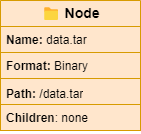
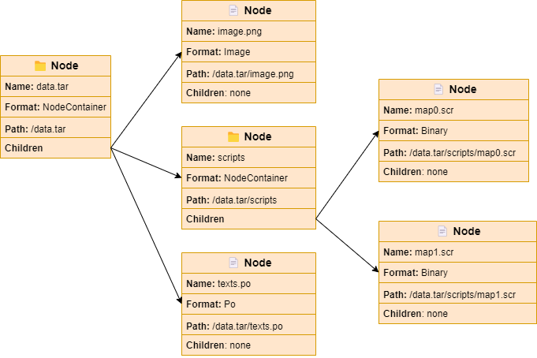

# Node

In Yarhl, a **node** is an entity that has a **name** and a
[**format**](../formats/formats.md). The concept is similar to a file or folder
on a computer hard-drive, but in this case is virtual, it's not a physical file
in the disk. Its format can be some bytes in a `Stream` like a disk file, but it
could also be any class that implements the
[`IFormat`](xref:Yarhl.FileFormat.IFormat) interface.



If the _format_ of the node is `NodeContainerFormat`, then we say that the node
is a **container**. This is the equivalent of a folder in our file system. These
nodes may have one or more node **children**.

By having nodes with children we can create a hierarchy similar to the file
system of our drives. We could navigate identify and navigate by their **path**.



Nodes is a core feature of Yarhl. It allows to represent with a hierarchy a set
of formats. Running [converters](../formats/converters.md) we can transform the
content of the nodes, for instance by reading, writing, unpacking, etc.

Combining nodes, [converters](../formats/converters.md) and the
[_sub-stream_ concept of `DataStream`](../binary/datastream.md#sub-streams), we
can represent a complex file system even when all the file data points to a
single `Stream` from a disk file.

Let's see it with an example from the
[Ekona](https://scenegate.github.io/Ekona/index.html) library that provides
implementation for _Nintendo DS_ formats.

```csharp
// Create node from a disk file
using Node game = NodeFactory.FromFile("game.nds", FileOpenMode.Read);

// Use the `Binary2NitroRom` converter to convert the binary format
// into node containers (virtual file system tree).
game.TransformWith<Binary2NitroRom>();

// Now we can access to every game file. For instance, we can export one file
Node gameFile = game.Children["data"].Children["graphics"].Children["map.bin"];

// Same FileStream but reading from different offsets.
// No disk writing was required.
Assert.AreEqual(gameFile.Stream.BaseStream, game.Stream.BaseStream);
```

## Children

TODO: collection and indexer. Navigator ref. Add and remove children.

## Format

TODO: GetFormat, Format, Stream, IsContainer, ChangeFormat

## Format conversion

TODO: how it affect children

## Tags

TODO: metadata, restore?

## Cloning a node

TODO

## Dispose

TODO
