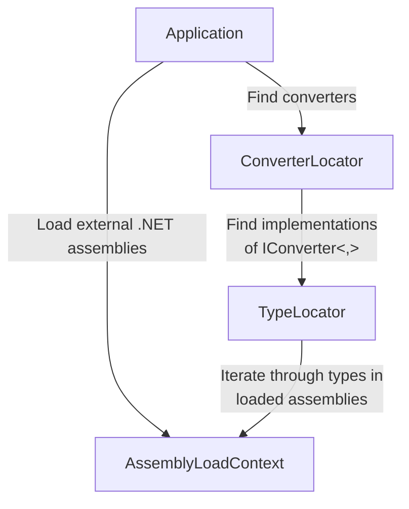

# Plugins overview

`Yarhl.Plugins` provides a set of APIs that helps to load .NET assemblies and
find types.

Its main goal is to find [converter](../core/formats/converters.md) and
[format](../core/formats/formats.md) types in external .NET assemblies. Generic
applications, like [SceneGate](https://github.com/SceneGate/SceneGate), that
have no knowledge in the converters to use, could use the APIs to find and
propose them to the user.

The _plugins_ are regular .NET libraries or executable that contains
implementations of _converters_ and _formats_. They don't need to implement any
additional interface or fullfil other requirements.

> [!WARNING]  
> Loading a .NET assembly will load also its dependencies. You may run into
> dependency issues if they use different versions of a base library such as
> Yarhl or Newtonsoft.Json.

The main APIs are:

- `AssemblyLoadContextExtensions`: extension methods for `AssemblyLoadContext`
  to load .NET assemblies from disk.
- `TypeLocator`: find types that implement a specific interface.
- `ConverterLocator`: find _converter_ and _format_ types.

You can get more information in their subpage.
