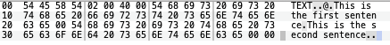
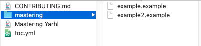

# Yarhl in a nutshell


**Yarhl** - _Yet Another ROM Hacking Library_ - is a library for _ROM Hacking_
and fan-translation projects. It provides a virtual file system, file format,
and format conversion features and plugin support.

But what it really has to offer? Why should you use it? And how? This tutorial
will teach you how to use Yarhl and how to take advantage of the 100% of it.

Remember that if you have any question you can create GitHub issues, contact the
contributors by email, Twitter or Discord. But first make sure you've read the
whole docs.

## Your first steps: Reading and Writing

Oh, hi! I'm Mister Yarhl (or M.Y.). Nice to meet you. I will be your guide!
Erm... y-you can... picture me like this:


Let's get started! The first module I'm teaching you is
[`Yarhl.IO`](xref:Yarhl.IO) (IO stands for _Input/Output_), which is similar to
.NET standard `System.IO` but with specific features to work with binary files.

This module is divided into binary and text files. Easy-peasy! Let's go deeper
into these classes!

### DataStream

[`DataStream`](xref:Yarhl.IO.DataStream) wraps any kind of .NET `Stream`.

#### Reuse of Stream

It allows to reuse a parent `Stream` to have substreams to reduce the number of
resources to use. For instance, to unpack a file you would just need to create
`DataStream` instances from the same parent `DataStream` having different
offsets and lengths.

Disposing the last instance of a `DataStream` that has a reference to a `Stream`
will dispose the `Stream` too.

#### Comparison

The `DataStream` class provides the
[`Compare`](<xref:Yarhl.IO.DataStream.Compare(System.IO.Stream)>) method to
check if two streams are identical.

#### Push and pop positions

Similar to the terminal commands `pushd` and `popd`, our `DataStream` provides
methods for moving temporarily to a position to perform an operation and then
restore the position. This is very useful when you need to read or write a few
fields in another section of the file. It works with an stack so you can push
several positions.

- [`PushCurrentPosition`](xref:Yarhl.IO.DataStream.PushCurrentPosition): save
  the current position.
- [`PushToPosition`](xref:Yarhl.IO.DataStream.PushToPosition*): save the current
  position and move.
- [`PopPosition`](xref:Yarhl.IO.DataStream.PopPosition): restore the last saved
  position.
- [`RunInPosition`](<xref:Yarhl.IO.DataStream.RunInPosition(System.Action,System.Int64,System.IO.SeekOrigin)>):
  push, run the lambda expression and pop again.

#### Read and Write

We have also the typical read and write methods for arrays of bytes. And don't
forget about the [`WriteTo`](<xref:Yarhl.IO.DataStream.WriteTo(System.String)>)
methods that allows to write a full `DataStream` in another `DataStream` or in a
file in your disk. Very useful mate!

### DataReader and DataWriter

[`DataReader`](xref:Yarhl.IO.DataReader) is the equivalent of the .NET
`BinaryReader` and [`DataWriter`](xref:Yarhl.IO.DataWriter) of `BinaryWriter.
Apart from the typical read and write methods, they provide the following very
useful features.

#### Endianness

By properties or constructor you can specify if the endianness of the stream is
little or big. This will affect to all the read and write operations.

#### Strings

By using the different overloads of `ReadString` and `Write` you can read and
write strings with different encodings, fixed sizes, null terminated or not or
in the format _size + content_ style. I recommend you to take a look into them,
they cover most of the cases you will need to work with files.

#### Padding

Are you tired of writing logic to skip or write padding bytes? Well, we too! If
you are reading a file and you want to skip padding bytes, you can call
[`SkipPadding`](<xref:Yarhl.IO.DataReader.SkipPadding(System.Int32)>) and if you
need to write padding bytes, then
[`WritePadding`](<xref:Yarhl.IO.DataWriter.WritePadding(System.Byte,System.Int32)>)
will be your friend.

### TextDataReader and TextDataWriter

So far, `DataReader` and `DataWriter` have been very useful when you are dealing
with a file that contains some integer fields for size or offset, arrays of
bytes and maybe null-terminated strings. But, what about if you need to work
with a file that only contains text and you are interested in reading line by
line? In that case, you need [`TextDataReader`](xref:Yarhl.IO.TextDataReader)
and [`TextDataWriter`](xref:Yarhl.IO.TextDataWriter).

#### New lines

By default, `TextDataWriter` uses always (Windows too) the new line `\n`. It
doesn't use `\r\n`. The reason is that most file formats uses `\n` and in some
games having the `\r` may crash. It's sometimes difficult to notice that. If you
want to use any other new line string (you can even use `<br/>`), you just need
to change the [`NewLine`](xref:Yarhl.IO.TextDataWriter.NewLine) property.

In the case of the `TextDataReader` the behavior is different. The default value
for the [`NewLine`](xref:Yarhl.IO.TextDataReader.NewLine) property depends on
the OS (Windows: `\r\n`, Unix: `\n`). In addition, we provided with an automatic
mechanism enabled by default:
[`AutoNewLine`](xref:Yarhl.IO.TextDataReader.AutoNewLine*). If it's enabled, you
don't need to know the line ending in advance because we will stop at `\n` and
remove the last `\r` if present. This is also useful if a file mix both line
endings. And remember, by setting the `NewLine` property `AutoNewLine` is
disabled.

#### Encoding

The encoding can only by specified in the constructor. We believe that it
doesn't have sense to change the encoding once you start using the reader
because a text file must not mix encodings.

#### Peeking

Do you need to read a line without actually moving the position of the stream?
Maybe you want to check if the line contains a token but you are not sure and
don't want to keep the current position all the time. Well, in that case you
have the `Peek*` methods.

#### Preambles / BOM

Some encodings may have a specific
[BOM](https://en.wikipedia.org/wiki/Byte_order_mark) (_Byte Order Mark_) (or
_preamble_ in the .NET world). These are some bytes at the beginning of the
stream that confirms the encoding of the file. For instance, when using UTF-16,
the file will begin with the bytes `0xFEFF`. It also specifies if the encoding
is little-ending or big-endian (needed for UTF-16).

Our `TextDataReader` will skip the BOM (_if it's present_) at the beginning of
the file. In the case of the `TextDataWriter`, the behavior is defined by the
property [`AutoPreamble`](xref:Yarhl.IO.TextDataWriter.AutoPreamble) which is
set to `false` by default (again, some games may see it as unexpected bytes).
When enabled, the first write call will also write the BOM. You can also write
it manually by calling
[`WritePreamble()`](xref:Yarhl.IO.TextDataWriter.WritePreamble) (but remember,
only if you are at the beginning of the stream).

I know... I talk too much... Let's continue!

### Examples

#### Reading / writing a binary file

```csharp
public void LoadFile(string path)
{
    using (var stream = DataStreamFactory.FromFile(path, FileOpenMode.Read)) {
        var reader = new DataReader(stream) {
            DefaultEncoding = new EscapeOutRangeEncoding("ascii"),
            Endianness = EndiannessMode.BigEndian,
        };

        string id = reader.ReadString(4);
        int offset = reader.ReadInt32();
        reader.SkipPadding(32);
        double myDouble = reader.ReadDouble();

        string name;
        stream.RunInPosition(
            () => name = reader.ReadString(),
            offset);
    }
}

public void SaveFile(string path)
{
    using (var stream = DataStreamFactory.FromFile(path, FileOpenMode.Read)) {
        var writer = new DataWriter(stream);

        writer.Write("TEX0", false);
        writer.Write(0xCAFE);
        writer.Write(0x00);
        writer.WritePadding(0xFF, 32);
        writer.Write("My long text of 80 bytes", 80);

        stream.PushToPosition(0x08);
        writer.Write(0x65402);
        stream.PopPosition();
    }
}
```

#### Reading / writing a text file

```csharp
public void LoadFile(DataStream stream)
{
    var reader = new TextDataReader(stream, Encoding.Unicode);

    string firstLine = reader.ReadLine();
    char[] someChars = reader.Read(4);
    string beforeToken = reader.ReadToToken("#");

    if (reader.Peek() == ':')
        reader.ReadLine();
    string restFile = reader.ReadToEnd();
}

public void SaveFile(DataStream stream)
{
    var writer = new TextDataWriter(stream) {
        AutoPreamble = true,
    };

    writer.WriteLine("Hello world!");
    writer.WriteLine("Count is {0}", 42);
    writer.Write("No new line");
}
```

## Implementing file formats

Every game contains many files, which have a specific formats. For example files
with extension `.nclr` are a palettes, or `.aar` are a package files. Yarhl
helps you to code type as you were actually coding a game format.

To implement a file format, you just need to create a new class that implements
the (empty) [`IFormat`](xref:Yarhl.FileFormat.IFormat) interface. In this class
you just need to add the fields of your format. In more programming terms, your
format it's just a data model.

Let's go for a quick example! Take a look into the following bytes from a file
that seems to have text from a game menu:



This file seems to follow the following specification in little endian:

| Size | Name                      |
| ---- | ------------------------- |
| 4    | Magic ID                  |
| 2    | Number of sentences       |
| 2    | Size of the file          |
| \*   | Null-terminated sentences |

So given this format, we would implement the following class that maps the
specification:

```csharp
public class MenuSentences : IFormat
{
    public MenuSentences()
    {
        Sentences = new Collection<string>();
    }

    public uint MagicID { get; set; }

    public ushort FileSize { get; set; }

    public Collection<string> Sentences { get; private set; }
}
```

Easy! Don't worry about how to convert that format, we will talk about that
later.

### BinaryFormat

[`BinaryFormat`](xref:Yarhl.IO.BinaryFormat) is the most basic format since it
just represents raw bytes, a stream. It's... a _binary format_. This format is
assigned automatically when we open a file from Yarhl as we will see later.

Its only property [`Stream`](xref:Yarhl.IO.BinaryFormat.Stream*) allows you to
access to its inner stream.

### NodeContainerFormat

You may wonder... what about package formats like `.zip`? They are represented
with the format (or by inheriting it)
[`NodeContainerFormat`](xref:Yarhl.FileSystem.NodeContainerFormat). This format
contains a root folder, also known as `Node`. So let's see what a `Node` is.

## Entering the virtual world: Nodes

This is the main feature of Yarhl and the most important one, no doubt, 10/10
Yarhl users would say so<sup>1</sup>. Yarhl has a virtual file system to handle
your files while maintaining your computer intact, you can now delete your
"tests" folder and clean your desktop after-ages.

<sup>1</sup> <small>None of Yarhl users wants to talk with me anymore. This may
not be 100% accurate.</small>

### Nodes

A [`Node`](xref:Yarhl.FileSystem.Node) is a virtual file. It's like having a
file system with files and folder but only in memory for the duration of your
program. You can dynamically add and remove files / folders. These files and
folders are called nodes in Yarhl.

A node may have child nodes like a folder may have folders and files. You can
add the _subnodes_ with the
[`Add`](<xref:Yarhl.FileSystem.NavigableNode`1.Add(`0)>) method and you iterate
and access to its children with the
[`Children`](xref:Yarhl.FileSystem.NavigableNode`1.Children) property.

The node [`Name`](xref:Yarhl.FileSystem.NavigableNode`1.Name) must be unique.
You can also get the full path to the node in this new virtual filesystem. That
is, if you have a _root_ node with name `MyRoot` and you add a node `Node1`, the
[`Path`](xref:Yarhl.FileSystem.NavigableNode`1.Path) property for `Node1` will
be `/MyRoot/Node1`.

Ah, one more thing before I forget. Regular files in your disk have some bytes
associated, right? Well, in the case of nodes they have a
[Format](#implementing-file-formats) that we were talking before. That is, it
doesn't have to have bytes but it could be a type to represent image, texture,
text, font, ... The actual type of the node. For instance, let's say we create a
node from a disk file, it will have a `BinaryFormat` because for now it's just a
bunch of bytes. But if those bytes store a set of menu texts, we could transform
its format and associate its actual content type: `MenuSentences`. To the node
[`Format`](xref:Yarhl.FileSystem.Node.Format*) property you can set any type
that implements the [`IFormat`](xref:Yarhl.FileFormat.IFormat) interface.

By the way, there is a property to get the inner `DataStream` when the format of
the node is a `BinaryFormat`: [`Stream`](xref:Yarhl.FileSystem.Node.Stream). It
will return `null` if the type is not `BinaryFormat`. We added it because to do
cool things like:

```csharp
node.Stream.WriteTo("/home/mister_yarhl/my_node.bin");
```

If the type is different, you may want to check the method
[`GetFormatAs<T>()`](xref:Yarhl.FileSystem.Node.GetFormatAs``1).

### Why nodes?

Well, imagine that you have a Nintendo DS game `.nds`, you could open it with
Yarhl and access to its files and folders without actually extracting the files
in your disk. All access would be in memory, probably even sharing the same
stream thanks to the `sub-DataStreams`.

### Files vs folders

As said, folders in our virtual file system are also nodes. They always have the
`NodeContainerFormat` or any class that inherits it. This format is just a root
node folder that becomes the children of the node. You can use the property
[`IsContainer`](xref:Yarhl.FileSystem.Node.IsContainer*) to check if the node is
a node container, that is, if it's a folder.

It's more clear with a picture:



`mastering` would be our root node with format `NodeContainerFormat`. While
`example.example` and `example2.example` would be our two child nodes. By
default they will have a `BinaryFormat` format.

### Navigating the sea of nodes

Do you have many nodes? I guess it will be difficult to navigate through all of
them. Then, you want to review the class
[`Navigator`](xref:Yarhl.FileSystem.Navigator). It provides with features like
iterators and finders.

To iterate over the node children you would just do:

```csharp
foreach (var node in root.Children) {
    // Something
}
```

But if you want to iterate over the full tree of nodes, that is, including the
children of your children (like `node` in the above example), you can use the
`Navigator`.

```csharp
foreach (var node in Navigator.IterateNodes(root)) {
    // Something
}
```

You can even specify how to do the iteration: going first deeper into each node
([_depth-first search_](https://en.wikipedia.org/wiki/Depth-first_search)) or
getting first every children from the current node
([_breadth-first search_](https://en.wikipedia.org/wiki/Breadth-first_search)).

If you just want to search a specific node given a full path, you want to use
[`Navigator.SearchNode(path)`](<xref:Yarhl.FileSystem.Navigator.SearchNode``1(``0,System.String)>).

### Creating the file system

So you want to start using node right now, eh. Well, it will be easy. You will
want to check out the static helper class:
[`NodeFactory`](xref:Yarhl.FileSystem.NodeFactory). Let's check some of its
methods:

```csharp
// Manual
var node1 = new Node("name", new BinaryFormat(filePath));

// Factory
var node2 = NodeFactory.FromFile(filePath);  // Node name is the file name
```

So, what about creating a node from a folder you would say.

```csharp
var emptyFolder = NodeFactory.CreateContainer("name");

var folderFromDisk = NodeFactory.FromDirectory(folderPath);
```

Yeeeah! That's the face I was looking for! You can create a virtual file that
quick!

Don't forget to review the overloads and the method
[`FromMemory`](<xref:Yarhl.FileSystem.NodeFactory.FromMemory(System.String)>) to
create a node with data in memory.

Yarhl is way more interesting now, right!?

## Converters: putting together all the pieces

Finally! We have _formats_, _nodes_ and some classes for _IO_ operations. Now
everything begin to fall into place, you'll see.

Creating a tool to work with files usually require to work with different
formats, right? We need to convert from `.dat` to `.txt`, from `.bin` into a a
palette or unpacking several files from a `.pak` file.

Well, that's easy to do. Yarhl is all about converting formats, let's see an
example:

```csharp
public void ExportFontImage(string fontPath, string outputPath)
{
    using (var binary = new BinaryFormat(fontPath)) {
        var font = (Font)ConvertFormat.With<Font2Binary>(binary);
        var image = (Image)ConvertFormat.With<Font2Image>(font);
        image.Save(outputPath);
    }
}
```

1. We start creating a new `BinaryFormat` from a file path.
2. We convert the `BinaryFormat` (reading its `Stream`) into a `Font` type.
3. We convert the `Font` format into an `Image` type.
4. We save it to a physical file in the hard-drive.

_"But what's `Font2Binary` and `Font2Image`, **Mister Yarhl**?"_, you would say.
They are **converters**! A converter is a class which implements the
[IConverter](xref:Yarhl.FileFormat.IConverter`2) interface.

You can check some converter examples from the tools to translate _Pokémon
Conquest_. For instance:
[Font2Binary](https://github.com/pleonex/PokemonConquest/blob/master/AmbitionConquest/AmbitionConquest/Fonts/Font2Binary.cs)
and
[Font2Image](https://github.com/pleonex/PokemonConquest/blob/master/AmbitionConquest/AmbitionConquest/Fonts/Font2Image.cs).

### Converting formats

But let's come back to our example of `MenuSentences` from the
[format](#implementing-file-formats) section. It's turn to create a converter to
fill the `MenuSentences` class from a file. That it's to _read_ a file with that
format.

```csharp
public class Binary2MenuSentences : IConverter<BinaryFormat, MenuSentences>
{
    public MenuSentences Convert(BinaryFormat source)
    {
        var menu = new MenuSentences();
        var reader = new DataReader(source.Stream);

        menu.MagicID = reader.ReadUInt32();
        ushort numSentences = reader.ReadUInt16();
        menu.FileSize = reader.ReadUInt16();

        for (int i = 0; i < numSentences; i++) {
            menu.Sentences.Add(reader.ReadString());
        }

        return menu;
    }
}
```

So now we can get our menu instance with:

```csharp
public void ReadMenuFile(string filePath)
{
    using (var binary = new BinaryFormat(filePath)) {
        var menu = (MenuSentences)ConvertFormat.With<Binary2MenuSentences>(binary);
        // Do something with the menu instance
    }
}
```

Since there is just one converter `BinaryFormat -> MenuSentences` we can
simplify it even more:

```csharp
public void ReadMenuFile(string filePath)
{
    using (var binary = new BinaryFormat(filePath)) {
        MenuSentences menu = ConvertFormat.To<MenuSentences>(binary);
        // Do something with the menu instance
    }
}
```

Do you want to write your _new_ or _updated_ menu instance? Let's write a
converter to convert from `MenuSentences` to `BinaryFormat` and save in a file
in disk.

```csharp
public class MenuSentences2Binary : IConverter<MenuSentences, BinaryFormat>
{
    public BinaryFormat Convert(MenuSentences menu)
    {
        var binary = new BinaryFormat();
        var writer = new DataWriter(binary.Stream);

        writer.Write(menu.MagicID);
        writer.Write((ushort)menu.Sentences.Count);
        writer.Write((ushort)0x00); // Placeholder size to override later

        foreach (string sentence in menu.Sentences) {
            writer.Write(sentence);
        }

        binary.Stream.Position = 0x06;
        writer.Write((ushort)binary.Stream.Length);

        return binary;
    }
}
```

And that's it! I'm pretty sure you've got enough of converters

### Transforming nodes

Don't forget that a node can have a format. How do we _convert_ the format from
a node? We could use the approach from before, but there are two methods that
will **convert and update** the format of the node:
[`TransformTo`](xref:Yarhl.FileSystem.Node.TransformTo*) and
[`TransformWith`](xref:Yarhl.FileSystem.Node.TransformWith*). They will also
dispose the old format so we don't need to do anything, just transform several
times the format of our node until it's the one we want.

```csharp
var node = NodeFactory.FromFile(path);
node.TransformTo<MenuSentences>();

// Now node.Format is MenuSentences
```

or from the first example:

```csharp
public void ExportFontImage(string fontPath, string outputPath)
{
    using (var node = NodeFactory.FromFile(fontPath)) {
        node.TransformWith<Font2Binary>()
            .TransformWith<Font2Image>();

        node.GetFormatAs<Image>().Save(outputPath);
    }
}
```
