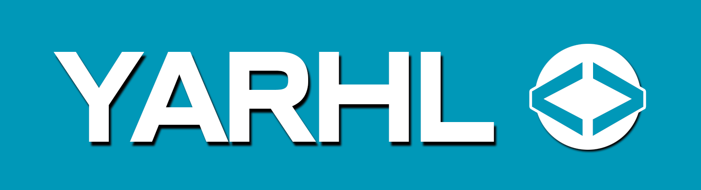

# Yarhl, A format ResearcH Library

_Yarhl_ is a set of libraries that helps to **implement and convert file
formats** It empowers you with...

- ♻️ ... APIs to easily **convert** between custom formats.
- 📚 ... **guidelines** to implement and test custom format converters.
- 🔢 ... advance **binary and text** reading / writing, encoding and
  serialization.
- 📃 ... **standard formats** implementation like **PO** for translations.
- 📂 ... virtual **file system** to unpack and pack containers efficiently.
- 🔌... **plugin** API to find formats and converters in .NET assemblies.

## Usage

The project has the following .NET libraries (NuGet packages via nuget.org). The
libraries only support .NET LTS versions: **.NET 6.0** and **.NET 8.0**.

- 
  - `Yarhl.FileFormat`: format conversion APIs.
  - `Yarhl.FileSystem`: virtual file system.
  - `Yarhl.IO`: streams, binary and text reading / writing.
- 
  - `Yarhl.Media.Text`: translation formats and converters (Po), table replacer.
  - `Yarhl.Media.Text.Encoding`: _euc-jp_ and token-escaped encodings.
- 
  - `Yarhl.Plugins`: load nearby .NET assemblies and find type implementations.
  - `Yarhl.Plugins.FileFormat`: find formats and converters from loaded
    assemblies.

> [!NOTE]  
> _Are you planning to try a preview version?_  
> Check-out the
> [GitHub project readme](https://github.com/SceneGate/Yarhl#install) for
> details on how to setup the NuGet preview feed for SceneGate projects.

## Quick demo

_Yarhl_ allows you to work with different file formats with an unified API for
conversion into binary (serialization / deserialization). Let's try to create a
new translatable file format
[PO](https://www.gnu.org/software/gettext/manual/html_node/PO-Files.html) from
[Yarhl.Media.Text](./articles/media-text/po-format.md) and save it into disk.

[!code-csharp[Demo PO](./../src/Yarhl.Examples/Introduction.cs?name=Demo_Po)]

It's frequent to find formats that are _containers_. _Yarhl_ allows to have a
_virtual file system_ to work with its content without having to extract it into
disk (saving space and time). For instance, let's open a game file from
_Nintendo DS_ that contains thousand of files. Then we will navigate through its
files, unpacking, decompressing and finally converting one file into _PO_. We
can use the following libraries for this task:

- [Ekona](https://scenegate.github.com/Ekona/): support of NDS game file system.
- [LayTea](https://github.com/pleonex/LayTea): support of formats from
  _Professor Layton_ games.

[!code-csharp[Demo containers](./../src/Yarhl.Examples/Introduction.cs?name=Demo_Containers)]

## Showcase

Some cool projects built with _Yarhl_:

- [**Texim**](https://github.com/SceneGate/Texim): experimental API for image
  file formats.
- [**Ekona**](https://scenegate.github.io/Ekona/): support Nintendo DS file
  formats.
- [**Lemon**](https://github.com/SceneGate/Lemon/): support Nintendo 3DS file
  formats.
- [**LayTea**](https://www.pleonex.dev/LayTea/): modding tools for _Professor
  Layton_ games.
- [**Attack of Friday Monsters tools**](https://github.com/pleonex/AttackFridayMonsters):
  modding tools for _Attack of the Friday Monsters_ game.
- [**Metatron**](https://github.com/TraduSquare/Metatron): translation framework
  for _Shin Megami Tensei_ saga games.

## License

The software is licensed under the terms of the
[MIT license](https://choosealicense.com/licenses/mit/).
